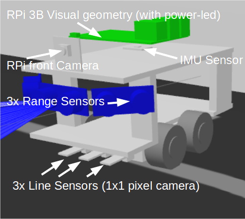
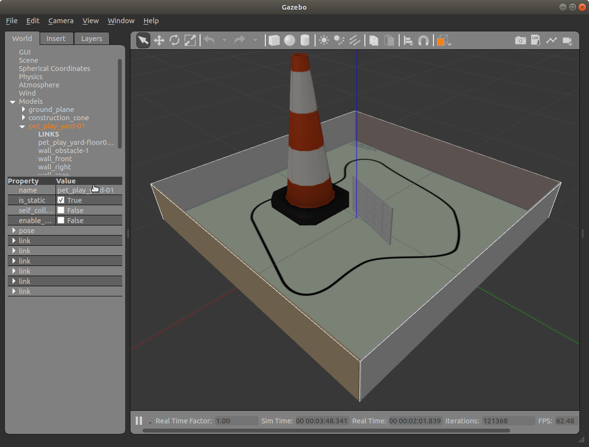
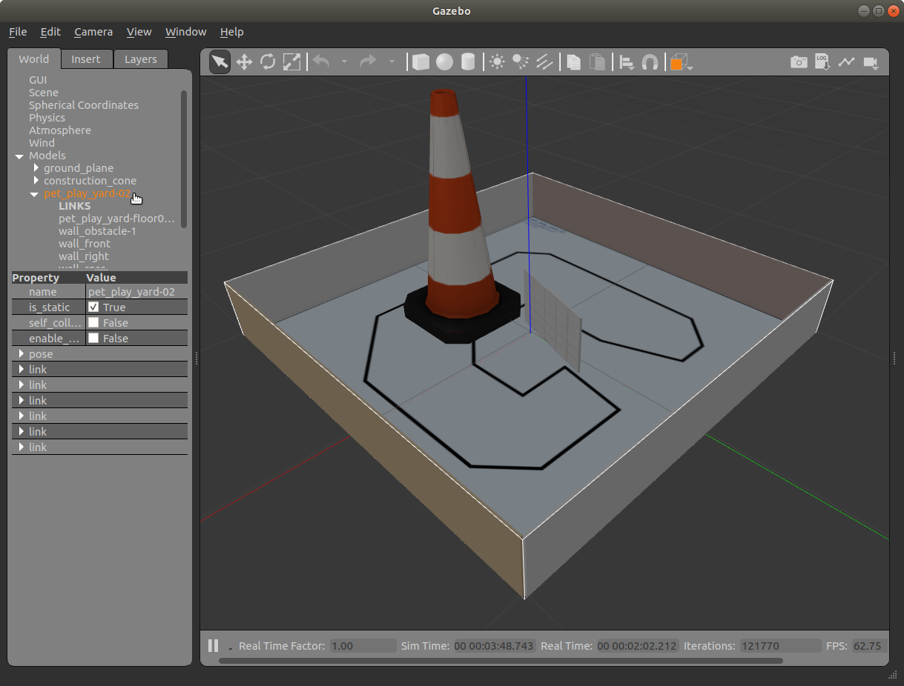
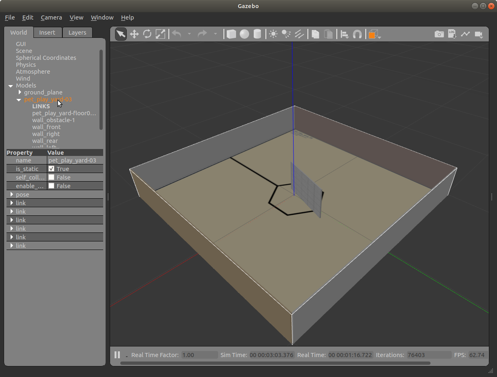
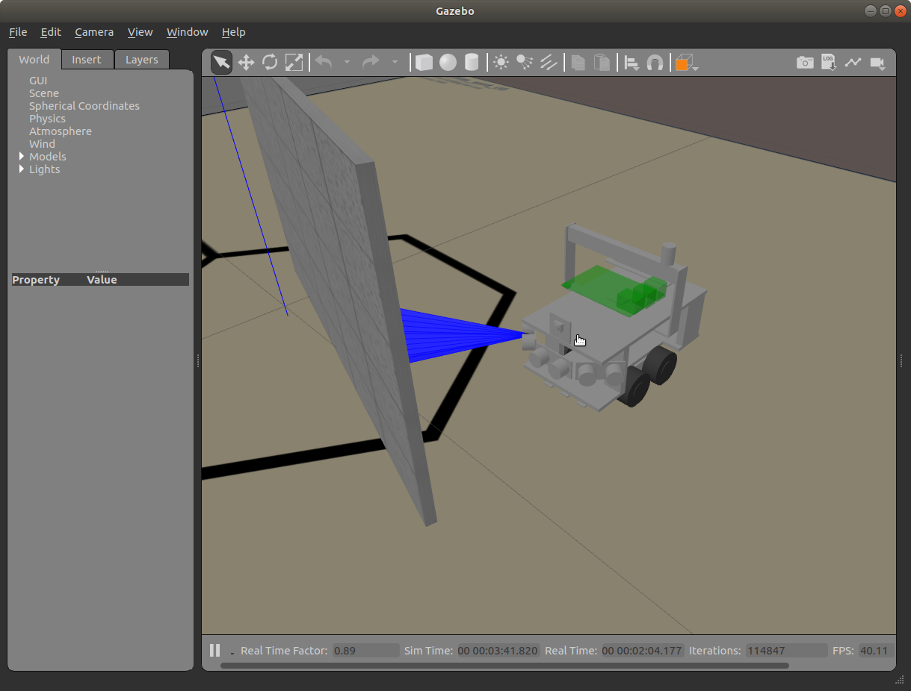
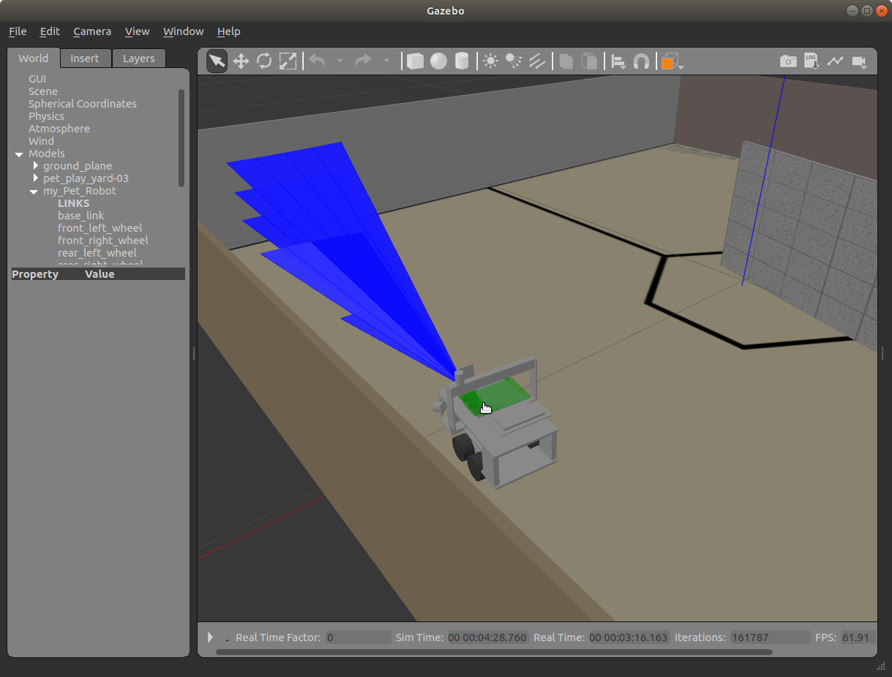
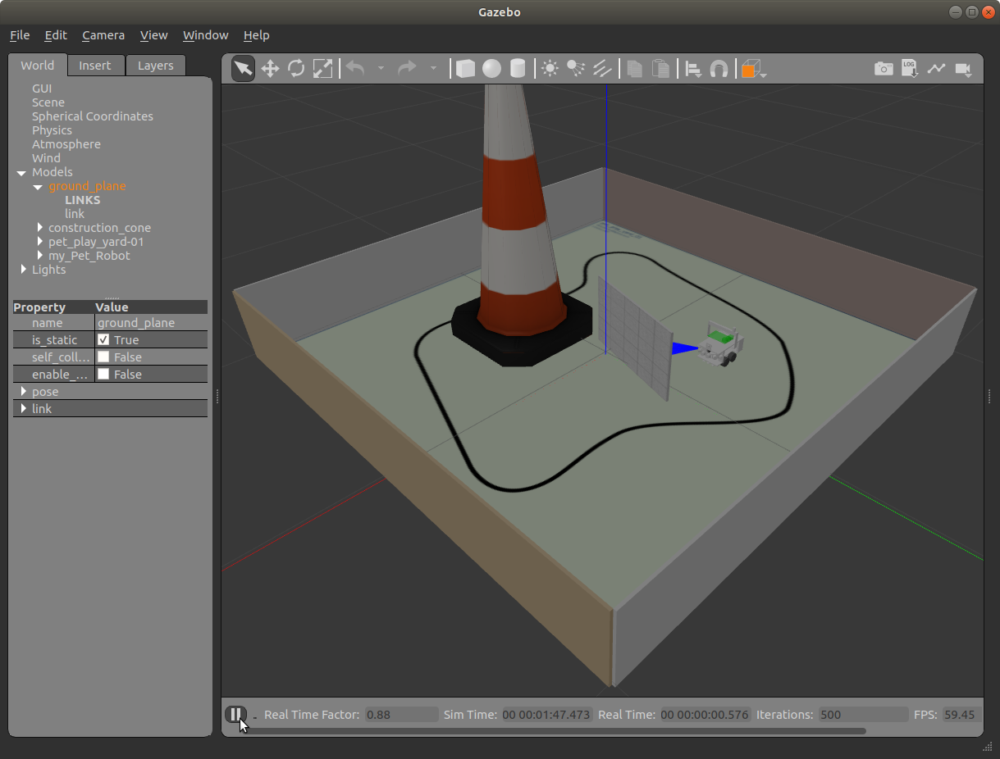
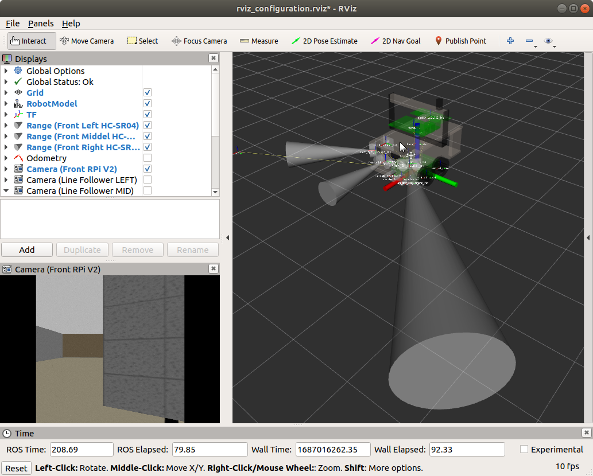
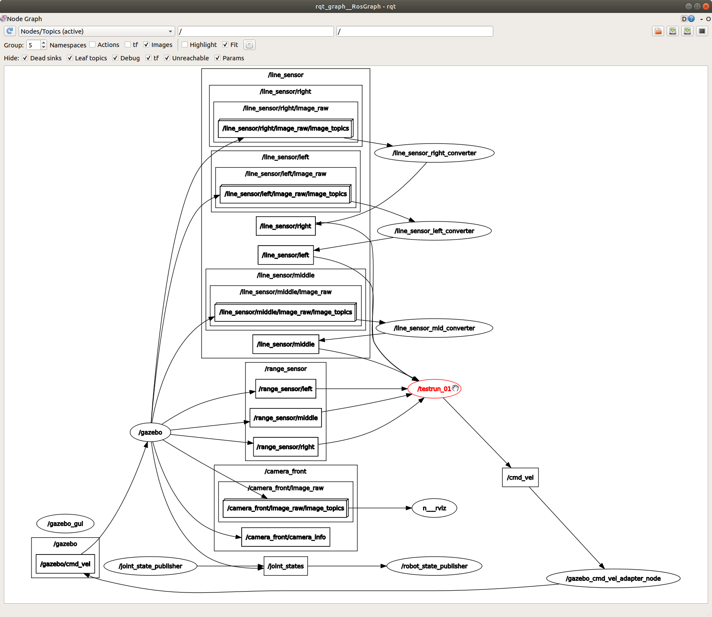

# README: /pet_mk_iv_simulation/ #

ROS1 repository in the https://github.com/Pet-Series Git-Organizations.</br>
Containing a Pet-Nk.IV ROS1-package / data for Gazebo & RViz

The following repositoris need to spawn the rebot and run missions scripts.
* https://github.com/Pet-Series/Pet-Mk-IV.git 
* https://github.com/Pet-Series/pet_mk_iv_simulation.git &ensp;`<-This repository`

## **What is this folder for?** ##
ROS package neccesary to be able to run robot simulation of Pet-Mk.IV, using Gazebo.</br>

<table>
    <tr>
        <td>
            
        </td>
        <td width="500px">
            This package is only necessary if you are going to launch your robot into a simulated world.</br>
            </br>
            If you only will run the physical robot - Then you do not need this package.
        </td>
    </tr>
</table>


# Setup
## **How do I get set up?** ##

Set up for simuation in Gazebo
* PC with Ubuntu 20.04
* ROS1 melodic</br>
* Install repo:
  ```
  ~$ mkdir -p ros_ws/src
  ~$ cd ros_ws/src
  ~/ros_ws/src$ git clone https://github.com/Pet-Series/Pet-Mk-IV.git
  ~/ros_ws/src$ git clone https://github.com/Pet-Series/pet_mk_iv_simulation.git
  ~/ros_ws/src$
  ```
  ```
  ~/ros_ws/src$ cd ..
  ~/ros_ws$ 
  ```
  ```
  ~$ cd ros_ws 
  ~/ros_ws$ catkin_make  (vs. $ catkin build  ??)
  ~/ros_ws$
  ```
  
# Examples
## **Spawn Gazebo worlds** (Play yard #1)
1. Start Gazebo
1. Spawn the world(play yard)
* Start a new terminal window
  ```
  ~$ cd ros_ws
  ~/ros_ws$ source devel/setup.bash
  ~/ros_ws$ roslaunch pet_mk_iv_simulation pet_play_yard-01.launch
  ```
  <table>
      <tr>
          <td>
              
          </td>
          <td width="500px">
              Example Gazebo world #1
          </td>
      </tr>
  </table>

## **Spawn Gazebo worlds** (Play yard #2)
1. Start Gazebo
1. Spawn the world(play yard)
* Start a new terminal window
  ```
  ~$ cd ros_ws
  ~/ros_ws$ source devel/setup.bash
  ~/ros_ws$ roslaunch pet_mk_iv_simulation pet_play_yard-02.launch
  ```
  <table>
      <tr>
          <td>
              
          </td>
          <td width="500px">
              Example Gazebo world #2
          </td>
      </tr>
  </table>

## **Spawn Gazebo worlds** (Play yard #3)
1. Start Gazebo
1. Spawn the world(play yard)
* Start a new terminal window
  ```
  ~$ cd ros_ws
  ~/ros_ws$ source devel/setup.bash
  ~/ros_ws$ roslaunch pet_mk_iv_simulation pet_play_yard-03.launch
  ```
  <table>
    <tr>
        <td>
            
        </td>
        <td width="500px">
            Example Gazebo world #3
        </td>
    </tr>
  </table>


## **Example: Spawn the robot, and run a mission node, into a existing Gazebo world**
Manual step by step
1. Gazebo alredy started  &ensp;`<- See any step above` <br>
   The world(play yard) already spawned &ensp;`<- See any step above`
1. Spawn the the robot &ensp;`<- From a new terminal window`
1. Run a simple test mission &ensp;`<- From a new terminal window`<br>
   Avoid wall/obsticle - Stap when passing a line
* `Start a new terminal window`
  ```
  ~$ cd ros_ws
  ~/ros_ws$ source devel/setup.bash
  ~/ros_ws$ roslaunch pet_mk_iv_simulation spawn_pet_mk_iv.launch
  ```
  <table>
    <tr>
        <td>
            
        </td>
        <td width="450px">
            x<br>
            x
        </td>
    </tr>
  </table>

* `Start a new terminal window`
  ```
  ~$ cd ros_ws
  ~/ros_ws$ source devel/setup.bash
  ~/ros_ws$ rosrun pet_mk_iv_mission_control testrun_01_avoid-wall-line-stop.py
  ```
  <table>
    <tr>
        <td>
            
        </td>
        <td width="450px">
            Example of a node/mission script<br>
            Differencies/Equality between the IRL/physical robot and this digital twin.<br>
            + Same behaivour: Avoid wall/obsticle<br>
            + Same behaivour: Stop when running on a line<br>
            - No visiable update for LCD-display<br>
            - No IR-remote control<br>
            - No visible lamp/beacon<br>
        </td>
    </tr>
  </table>


## **Example: Spawn/Launch all at oence**, in one step, into Gazebo
All steps at once (All steps in one .launch file)
1. Start Gazebo
1. Spawn the world(play yard)
1. Spawn the the robot
1. Launch a simple test mission <br>
   Avoid wall/obsticle - Stap when passing a line
* `Start a new terminal window`
  ```
  ~$ cd ros_ws
  ~/ros_ws$ source devel/setup.bash
  ~/ros_ws$ roslaunch pet_mk_iv_simulation testrun_01_avoid-wall-line-stop.launch
  ```
  <table>
      <tr>
          <td>
              
          </td>
          <td width="500px">
                Example: spawn, launch and run in one step<br>
                <br>
                Note: To start the simulation in Gazebo -> Press [Play] in Gazebo
          </td>
      </tr>
  </table>

## **Launch RViz**
Vizualize in real time all robot sensor data...
1. When the robot is running in Gazebo
1. Launch RViz
* Start a new terminal window
  ```
  ~$ cd ros_ws
  ~/ros_ws$ source devel/setup.bash
  ~/ros_ws$ roslaunch pet_mk_iv_description rviz.launch
  ```
  <table>
      <tr>
          <td>
              
          </td>
          <td width="500px"; vertical-align:"top">
              Example: Pet-Mk.IV realtime vizualization with RViz<br>
              - TF tree<br>
              - All sensors<br>
              - Camera
          </td>
      </tr>
  </table>

## **Launch rqt_graph**
Vizualize relevant nodes and topics
1. When the robot is running in Gazebo
1. Launch rqt_graph 
* Start a new terminal window
  ```
  ~$ cd ros_ws
  ~/ros_ws$ source devel/setup.bash
  ~/ros_ws$ rqt_graph
  ```
  <table>
      <tr>
          <td>
              
          </td>
          <td width="500px">
              Example: Pet-Mk.IV realtime vizualization with RViz<br>
              - TF tree<br>
              - All sensors<br>
              - Camera
          </td>
      </tr>
  </table>  

### **Who do I talk to?** ###
* "SeniorKullken" <stefan.kull@gmail.com>
* "Kullken" <karl.viktor.kull@gmail.com>
